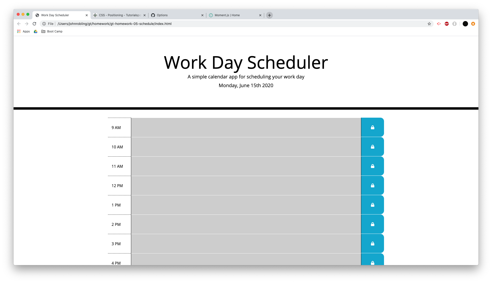

#Work Day Scheduler

## Description

This page allows the user to add hourly events to the calendar on their local machine.

## Installation
    
1. pull repo to local machine
2. open index.html

## Usage

[Deployed Site](https://roblingjohn.github.io/gt-homework-05-schedule/)

For each hour block, the user can type in events to be saved to local memory. After entering the text, they can click the lock button in the right column to save the data.

## Credits

This page was modified by John Robling from the template given for the purposes of this class. CSS provided by Bootstrap (http://getbootstrap.com). Time elements provided by moment.js (https://momentjs.com/). 